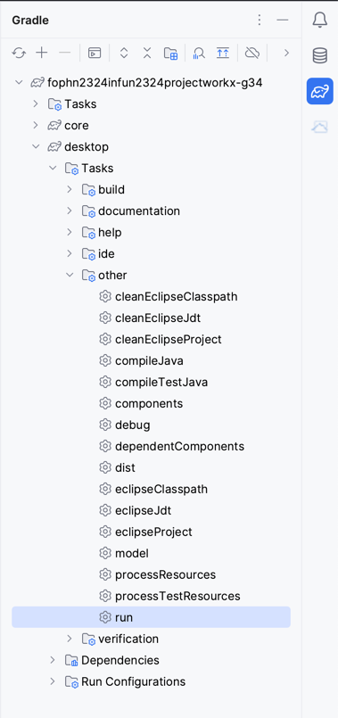
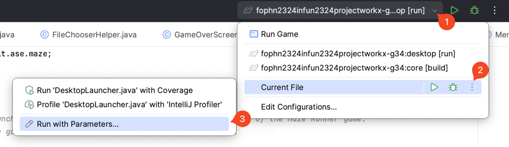
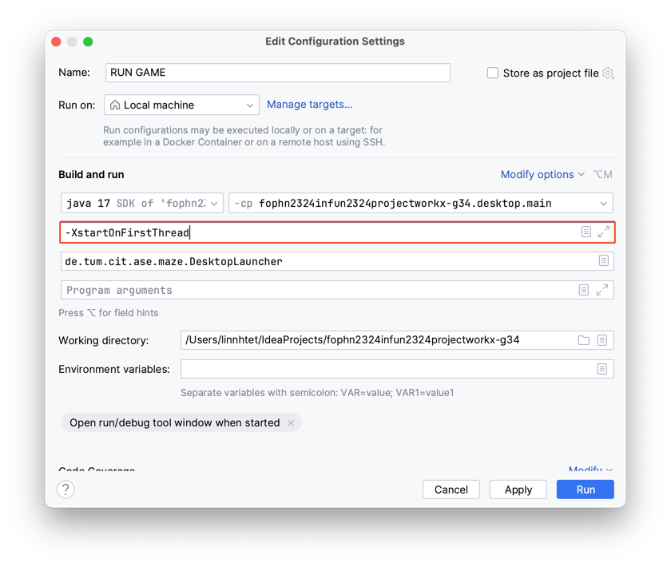

# Maze Runner Game

# Introduction

**Maze Runner** is a captivating and challenging top-down pixel-themed game, developed using Java and LibGDX framework, where players have to navigate through complex mazes. 
With a limited number of lives (3 to be exact), players must strategically maneuver their character, 
collecting a key and finding their way to the exit to claim victory. 
The game presents an exciting blend of exploration and strategy, set in a visually appealing pixel world.

This game is my Project for the first semester at TUM Campus Heilbronn, BIE.

## Game Mechanics

### Navigation and Objective
- Players have to guide their character through complex mazes using the `arrow` keys.
- The ultimate goal is to collect a key and reach the exit point.
- Players can also attack by pressing `A` on the keyboard.

### Lives and Challenges
- Players start with three lives.
- The maze is filled with dangers, including deadly traps and hostile mobs.
- Static traps pose a threat only when their fire is released; timing is key to avoid damage.
- Dynamic mobs roam the maze and can be defeated in combat. (They also have 3 lives)

### Buffs and Collectables
- Speed Buff: Temporarily increases the player's speed, aiding in navigation and escape.
- Collectable Hearts: Scattered throughout the maze, these hearts provide additional lives, extending the player's chances of survival.

### Map Construction and Types
Players have a chance to construct their own maps. Maps are stored in Java `properties` files format in the `map` folder, 
allowing easy customization and creation of new mazes. 
Each file contains key-value pairs representing the maze's layout:

| Values | Object Types       | Properties                           |
|--------|--------------------|--------------------------------------|
| 0      | Wall               | Blocks the path                      |
| 1      | Player Spawn Point | Starting point for the player        |
| 2      | Exit               | Exit point of the maze               |
| 3      | Static Trap        | Stationary hazard                    |
| 4      | Dynamic Mob        | Moving enemy                         |
| 5      | Key                | Required to open the exit            |
| 6      | Additional Hearts  | Grants extra life                    |
| 7      | Speed Buff         | Temporarily increases player's speed |

Each key in the properties file represents a coordinate in the format `x,y`, while the value determines the type of object present at that location.

## Development Tools and Frameworks

**Maze Runner** is built using a combination of robust technologies and frameworks, ensuring a seamless and immersive gaming experience. 
Here's a breakdown of the key technologies used:

### Programming Language
- **Java**: The game is developed using Java, a versatile and powerful programming language. Specifically, Java Version 17.0.9 and JDK 17 were used during development.

### Game Development Framework
- **LibGDX**: This is a comprehensive game development framework used to build Maze Runner. LibGDX simplifies the game development process, offering utilities for rendering, input handling, and more.
    - Version: 1.12.1

### Additional Libraries
- **gdx-nativefilechooser**: For file selection dialogs within the game. Version: 2.3.0

### Build Tool
- **Gradle**: Used for automating the build process, managing dependencies, and setting up the project environment.

### Development Environment
- Integrated with tools like IntelliJ IDEA through the Gradle plugin, facilitating a smooth development workflow.

## Class Structure
- The Class structure of the project can be found [here](https://lucid.app/lucidchart/9c9786bd-88cb-483d-8db0-2a79d52818ea/edit?viewport_loc=6215%2C-713%2C1701%2C983%2CHWEp-vi-RSFO&invitationId=inv_1099b470-b960-46d7-a246-a2cdac14d204).

## Getting Started

To get started with Maze Runner, you'll need to set up your development environment. This section guides you through the prerequisites and steps required to run the game on your machine.

### Prerequisites

Before you can run Maze Runner, ensure you have the following installed:

- **Java**: The game is developed in Java, so you will need Java installed to run it. You can download 
the latest version of Java from [Oracle's Java Download Page](https://www.oracle.com/java/technologies/javase-downloads.html).
- **IDE of Your Choice**: While Maze Runner can be built and run using any Java-compatible IDE, we recommend using an IDE 
such as [IntelliJ IDEA](https://www.jetbrains.com/idea/) (community edition suffices), [Eclipse](https://www.eclipse.org/), or [NetBeans](https://netbeans.apache.org/) for a smoother experience.

Once you have these prerequisites installed, you're ready to clone the repository and start exploring Maze Runner.

### Importing the Project

To import the Maze Runner game project into your IDE, follow the instructions specific to your development environment:

#### IntelliJ IDEA
1. Open IntelliJ IDEA or Android Studio.
2. Select `File -> Open` and navigate to the `build.gradle` file in your project.
3. Choose `Open as Project`.

#### Eclipse
1. Open Eclipse.
2. Choose `File -> Import... -> Gradle -> Existing Gradle Project`.
3. Make sure that your freshly generated project is not located inside your workspace.

#### NetBeans
1. Open NetBeans.
2. Select `File -> Open Project`.

After importing the project, you might need to refresh the Gradle project if some dependencies weren't downloaded yet:

#### IntelliJ IDEA
- Click the `Reimport all Gradle projects` button, which is represented by a pair of circling arrows at the top left in the Gradle tool window. This window can be accessed via `View -> Tool Windows -> Gradle`.

#### Eclipse
- Right-click on your project and select `Gradle -> Refresh Gradle Project`.

### Getting it Running
If you want to execute your freshly imported project, you have to follow different steps, depending on your IDE and the platform you are targeting.

#### In IDEA:
1. Extend the Gradle tab on the right sight of your window  

2. Expand the tasks of your project and then select and run: `desktop -> Tasks -> other -> run`.

**Alternatively**, you can create a run configuration:
1. Open the `DesktopLauncher` class.
2. Follow the steps described in the picture below.  

3. Make sure to set up the configuration as below.  

> **Note:** The VM Option `XstartOnFirstThread` is only required if you are running on macOS. Otherwise, delete this option.
4. `Apply` the changes and `Run` the project.

## Team Members
- [Nyi Nyi Linn Htet](https://github.com/lynnhtkk)

## Contributors
- [Hejunjie Cao](https://github.com/hejunjiecao)

## Acknowledgments
- **TileSets** and **Animated Entites**
  - [stealthix](https://stealthix.itch.io)
  - [kenny-assets](https://kenney-assets.itch.io)
  - [bdragon1727](https://bdragon1727.itch.io)
  
- **Background Music**
  - [Zane Little Music](https://opengameart.org/users/zane-little-music)
